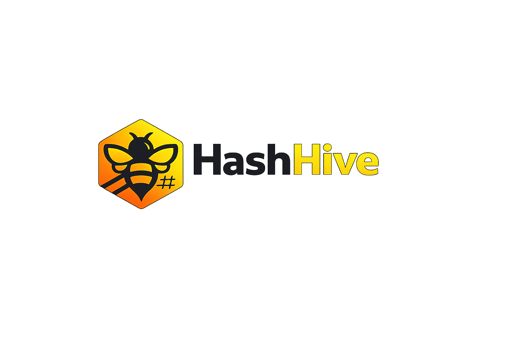

<div align="center">



**Unified mining dashboard for NMMiner, BitAxe and NerdAxe**

[](https://python.org)
[](https://fastapi.tiangolo.com)
[](LICENSE)

</div>

---

## Features

| | |
|---|---|
| 📊 **Dashboard** | Live fleet stats — hashrate, temperature, power, share rate · block-chance odds · live log |
| ⛏️ **Lottominer** (NMMiner) | Per-device table · full configure modal (pool · WiFi · time · display) · pool push |
| 🔧 **BitAxe / NerdAxe** | Live stats · per-device configure modal (pool · fallback · WiFi · fan · freq/voltage) · pause / resume / restart / identify · bulk actions · inline rename |
| 🪙 **Solo miners** | NerdMiner & SparkMiner monitoring |
| 🌐 **Pool** | Push primary + fallback pool to all devices at once · saved pool presets · live pool status |
| 👥 **Groups** | Group devices and run pool-switch / restart / pause actions on a whole group |
| 🗓️ **Schedules** | Time-based automation — restart / pause / resume / pool-switch on a cron-like schedule |
| 📑 **Templates** | Save and apply reusable device configurations |
| 💰 **Wallets & Earnings** | Track payout wallets and estimated earnings |
| 📈 **Analytics** | Block / best-share predictions (Poisson) · KPI strip · best-share trend · efficiency ranking · all-time leaderboard |
| 🔍 **Discovery** | One unified "Add device" flow · subnet auto-scan · continuous background discovery |
| 🌡️ **Automation** | PID auto-fan control · auto-restart on stalled hashrate |
| 🔔 **Alerts** | Offline · temp spike · VR temp · hashrate drop · error rate · fan failure · pool loss · fallback · reboot · RSSI · block found — each toggleable with editable thresholds |
| 📨 **Notifications** | Telegram · Discord · Gotify · ntfy · Pushover · weekly summary · live self-updating Discord dashboard embed |
| 📋 **Live Log** | Source badges · search filter · up to 30 days history · persists across refresh |

---

## Quick Start

### Option A — Setup Script (recommended)

**Linux / macOS**
```bash
git clone https://github.com/fgrfn/hashhive.git
cd hashhive
chmod +x setup.sh && ./setup.sh
```

**Windows**
```powershell
git clone https://github.com/fgrfn/hashhive.git
cd hashhive
.\setup.ps1
```

Both scripts: check Python 3.10+, create `.venv/`, install dependencies, optionally configure autostart (systemd / Task Scheduler).

---

### Option B — Manual

```bash
git clone https://github.com/fgrfn/hashhive.git
cd hashhive
python3 -m venv .venv
source .venv/bin/activate        # Windows: .venv\Scripts\activate
pip install -r backend/requirements.txt
uvicorn backend.main:app --host 0.0.0.0 --port 8000
```

---

### Option C — Docker

```bash
git clone https://github.com/fgrfn/hashhive.git
cd hashhive
docker compose up -d
```

Data (config, logs, device state) persists in the `hashhive-data` volume.  
Change the port in `docker-compose.yml`: `"9000:8000"`.

---

## Access

| URL | |
|---|---|
| `http://localhost:8000` | Dashboard |
| `http://localhost:8000/docs` | Swagger API docs |

---

## Configuration

On first start, `dashboard_config.json` is created automatically. Add devices via the **Add device** flow (auto-scan or manual IP) and configure via the **Settings** page:

- Device lists — Lottominer (NMMiner), BitAxe / NerdAxe, NerdMiner, SparkMiner (each standalone by IP)
- Alert rules — toggle each detector on/off and edit its threshold (chip temp · VR temp · min hashrate · error rate · RSSI · offline grace)
- Refresh interval and offline grace period
- Notification channels (Telegram / Discord / Gotify / ntfy / Pushover) — with per-channel test
- Weekly summary schedule (day + time)
- Live Discord dashboard (self-updating fleet embed)
- Auto-fan (PID) and auto-restart automation
- Pool presets (saved on the Pool page)

---

## Log Rotation

Logs are stored as daily files in `data/logs/YYYY-MM-DD.json`:

- Max **1 000 entries** per day
- Files older than **30 days** are deleted automatically
- The Alert History page supports filtering by 1 / 3 / 7 / 14 / 30 days
- Legacy `alert_history.json` is migrated automatically on first start

---

## Manage Autostart

**Linux (systemd)**
```bash
sudo systemctl status|stop|disable hashhive
sudo journalctl -u hashhive -f
```

**Windows (Task Scheduler)**
```powershell
Stop-ScheduledTask    -TaskName "HashHive"
Unregister-ScheduledTask -TaskName "HashHive" -Confirm:$false
```

---

## GitHub Actions

| Workflow | Trigger | Was passiert |
|---|---|---|
| **Secret Scan** | Jeder Push / PR | `gitleaks` scannt die gesamte Git-History auf API-Keys, Tokens, Passwörter |
| **Release Please** | Push auf `main` | Analysiert Commits; öffnet/aktualisiert Release PR mit `CHANGELOG.md` + `version.txt` Bump |
| **Release** | `v*`-Tag (nach Merge des Release PR) | Docker-Build → Push zu GHCR; GitHub Release mit `docker run`-Snippet |

### Release auslösen

Commits nach [Conventional Commits](https://www.conventionalcommits.org/) schreiben:

| Prefix | Version-Bump |
|---|---|
| `feat: ...` | Minor (`1.0.0 → 1.1.0`) |
| `fix: ...` | Patch (`1.0.0 → 1.0.1`) |
| `feat!: ...` | Major (`1.0.0 → 2.0.0`) |
| `chore:`, `docs:` | kein Release |

Nach dem Merge des Release PR steht das Image bereit:

```bash
docker pull ghcr.io/fgrfn/hashhive:latest
```

---

## Version

Die App-Version steht in [`version.txt`](version.txt) und wird automatisch durch Release Please aktualisiert.

- **Backend** liest `version.txt` beim Start und exposes sie in `/api/health`
- **Frontend** zeigt die Version in der Sidebar (lädt von `/api/health`)
- **Docker-Image** enthält `version.txt` im Build-Kontext

---

## Stack

- **Backend** — Python 3.10+ · FastAPI · httpx · asyncio · per-family miner drivers (`backend/miners/`)
- **Frontend** — React 19 · TypeScript · Vite · Zustand
- **Persistence** — JSON files · daily log rotation · no database required
- **Notifications** — Telegram · Discord · Gotify · ntfy · Pushover

---

## Discord integration

HashHive folds in the monitoring ideas from [bitaxe-discord-bot](https://github.com/fgrfn/bitaxe-discord-bot),
generalised from a single BitAxe to the whole fleet:

- **Alerts → Discord** — every alert type can be pushed to a Discord webhook (also Telegram / Gotify / ntfy / Pushover).
- **Live dashboard embed** — a single fleet-summary message that updates itself in place (hashrate, devices online, temp, power, shares). Enable it under **Settings → Notifications → Live Discord Dashboard**.
- **Weekly summary** — scheduled fleet recap.

> An interactive command bot (`!status`, `!hashrate`, …) is not yet included — push + live dashboard are.

---

## License

[MIT](LICENSE)
